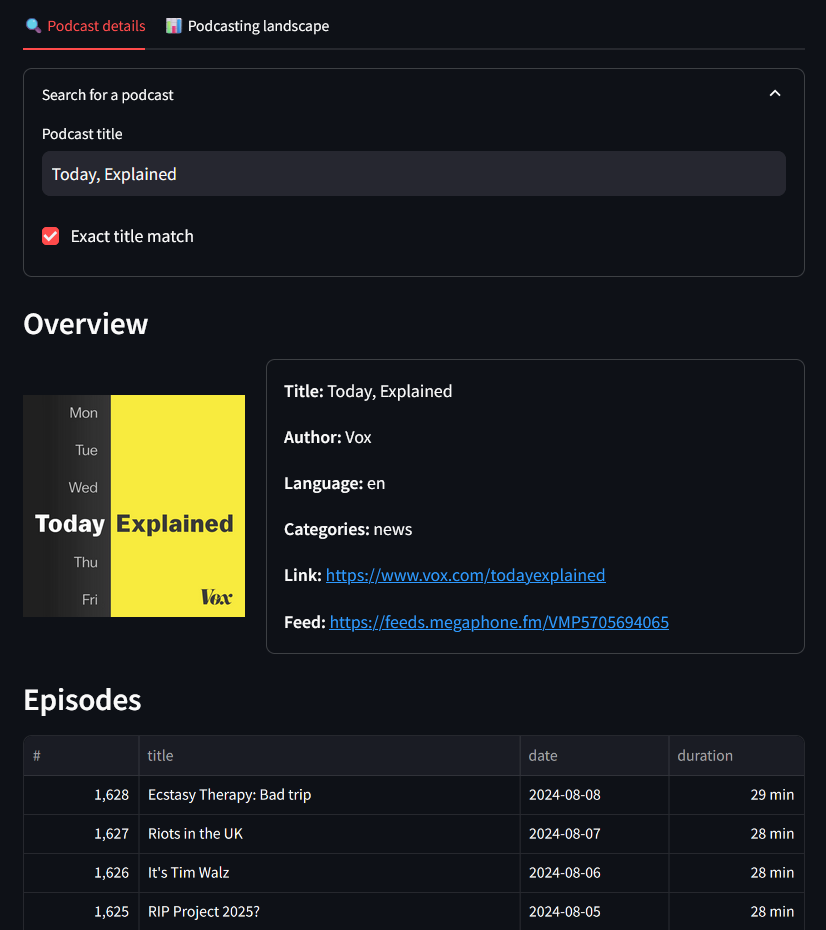

# :sound: Podscape

An app to explore the podcasting landscape -- from details concerning a specific podcast to overall, multi-decade trends.

This app was made for learning purposes, with a deliberate focus on `docker`, `streamlit`, `sqlite3`, and `polars`.
It sources its data from the [Podcast Index](https://podcastindex.org/) and directly from RSS feeds.




## Development setup

I propose a fully-dockerized, VS Code development environment:

- If you're under Windows: run `wsl` and start Docker Desktop.
- Run `make run-dev-env`.
- In the "Remote Explorer" tab (found in the Side Bar), find the Docker container, and select "Attach in Current Window".
- Extensions are not always mirrored from VS Code in the local OS to VS Code in the container. Reinstall the extensions you miss. The recommended python extension is mandatory.
- Set the python interpreter as `/usr/local/bin/python`.
- Open the `/app` folder, if that's not already where you are.
- If it's the first time you set this up (or if you want to update the database): run `make etl-enrich` to fetch and prepare the database. This takes a while (i.e., 42 min as of 2024-08-09).
- You're all set:
  - Launch the app using `make run-app`.
  - You can use the VS Code "Run and Debug" features.
  - If you want to run python code interactively in the development environment, add the following shortcut:
  ```
  {
      "key": "ctrl+enter",
      "command": "python.execSelectionInTerminal",
      "when": "editorTextFocus && !editorReadonly && editorLangId == 'python'"
  }
  ```
